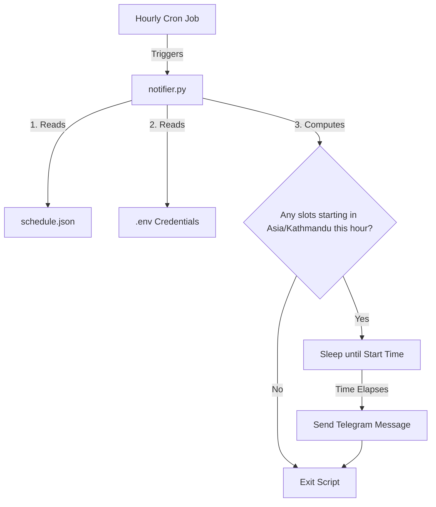

# Water Schedule Notification App - Design Specification

This document details the design for a simple, stateless Python application that reads a water supply schedule, calculates notification times, and sends alerts to Telegram.

## Goal
To receive automated Telegram notifications at the exact start times of scheduled water supplies. The schedule is stored in a JSON file (`schedule.json`) and updated periodically.

## Architecture & Flow

The system runs as an hourly Cron job that executes a Python script. 



### 1. Execution Schedule (Cron)
The script is run once per hour (e.g., at the top of the hour: `0 * * * *`). 
* Since the script is stateless and executes hourly, any changes to the `schedule.json` file will automatically be picked up during the next hour's run without needing to restart a service.

### 2. Timezone & Target Window
* The timezone is locked to `Asia/Kathmandu` (UTC+5:45).
* Upon execution at time $T_{now}$ (e.g. `2026-07-06 22:00:00`), the script identifies the current date (YYYY-MM-DD) and defines a 1-hour window:
  $$[T_{now}, T_{now} + 1\text{ hour})$$
* It searches the schedule for today's date and extracts all slots whose `start_time` falls within this window.

### 3. Delays & Sleep Logic
For each matching slot in the current window:
1. Parse the `start_time` (HH:MM) and combine it with the current date to get a target datetime $T_{start}$.
2. Calculate the delay in seconds:
   $$delay = (T_{start} - T_{now}).total\_seconds()$$
3. If $delay > 0$:
   * The script pauses/sleeps for the calculated duration (`time.sleep(delay)`) to ensure the notification is sent at the exact start minute.
4. If $delay == 0$ (starting exactly at the top of the hour), the message is sent immediately.
5. If there are multiple slots in the current hour, the script processes them in order (or using threads if overlapping/simultaneous, though they are usually sequential).

## Data Schema (`schedule.json`)
The schedule is represented in JSON using the following schema:
```json
{
  "YYYY-MM-DD": {
    "old_line": [
      {
        "start_time": "HH:MM",
        "end_time": "HH:MM"
      }
    ],
    "new_line": [
      {
        "start_time": "HH:MM",
        "end_time": "HH:MM"
      }
    ]
  }
}
```

## Telegram Message Format
Markdown formatting is used for Telegram messages:
```text
**Water Alert - [Date]**
Pipeline: [New/Old]
Start: [HH:MM]
End: [HH:MM]
```
Where:
* **[Date]** is the date in `YYYY-MM-DD` format.
* **[New/Old]** is either `New` (for `new_line`) or `Old` (for `old_line`).
* **[HH:MM]** is the start and end times respectively.

## Configuration & Credentials (`.env`)
The script loads credentials from environment variables (using a `.env` file in local development):
```env
TELEGRAM_BOT_TOKEN=your_telegram_bot_token_here
TELEGRAM_CHAT_ID=your_telegram_chat_id_here
```

## Error Handling
* **Missing Config:** If `.env` or required keys are missing, the script logs an error and exits.
* **Missing Schedule:** If `schedule.json` is missing or invalid, the script logs an error and exits.
* **API Failures:** If Telegram API fails (e.g. network timeout), it retries up to 3 times before logging the failure and exiting.
